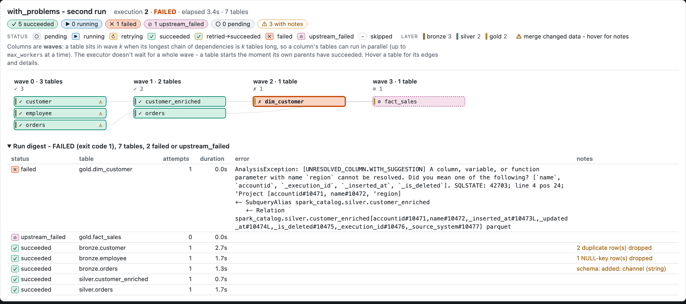

```bash
uv run python examples/with_problems/run.py --html graph.html
```

Same pipeline as the quickstart, two runs. Run 1 loads clean data. Run 2 loads a second delivery with four problems. Most tools let three of them pass silently. pipetree puts a **note** on the table.



| Problem | Table | Note |
| --- | --- | --- |
| Account 2 arrives twice in one batch | `bronze.customer` | `2 duplicate row(s) dropped`. The row with the highest `sequence_by` wins. |
| A row without `employee_id` | `bronze.employee` | `1 NULL-key row(s) dropped` |
| A new `channel` column | `bronze.orders` | `schema: added: channel (string)`. With `schema_policy: evolve` the column is added. |
| A column that does not exist | `gold.dim_customer` | `failed`. `gold.fact_sales` is `upstream_failed`. |

A table with notes gets an amber badge in the graph and `notes: ...` in the digest. Its status does not change. The last row is a real failure: the run exits with 1.

Details: [Notes and run log](../../concepts/notes-and-run-log/).
